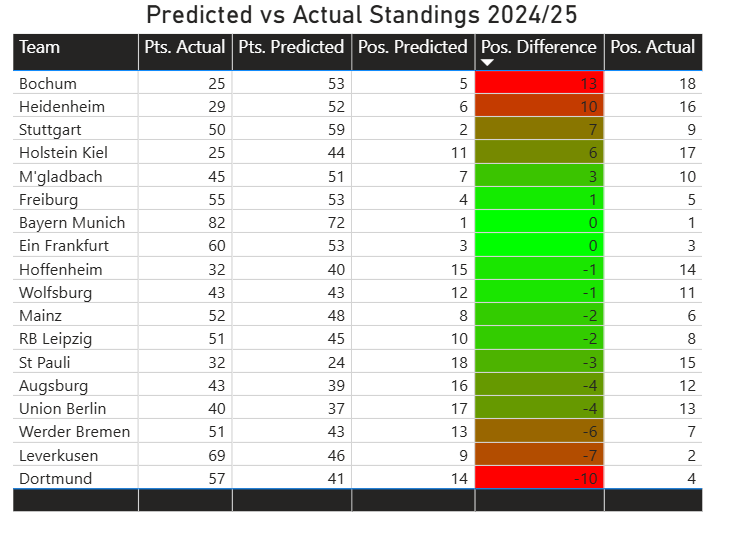
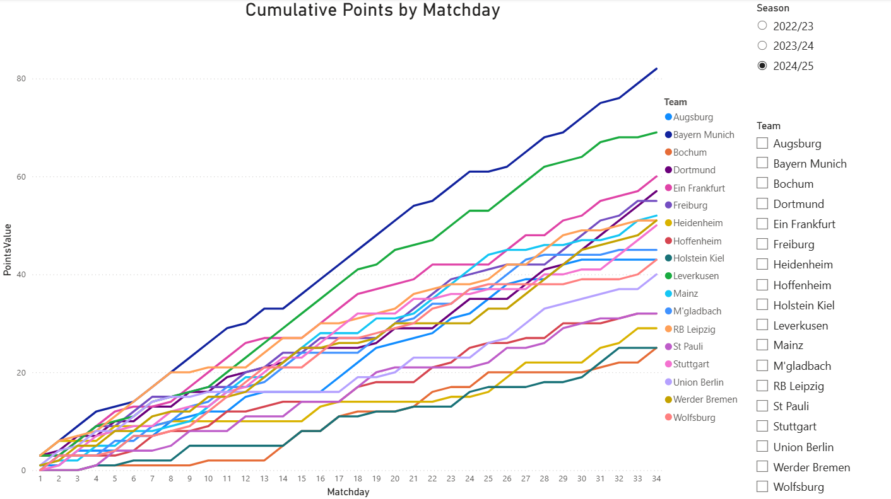
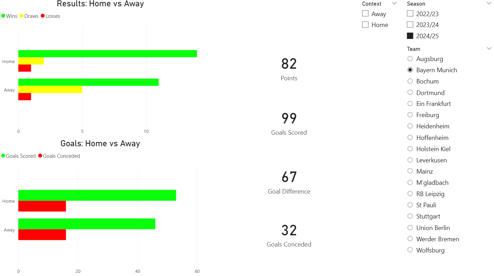

# Bundesliga Match Predictor

A machine learning pipeline that predicts Bundesliga final standings using historical match data, validated against 2024/25 actuals and visualized through an interactive Power BI dashboard.

## Demo

[Watch the Dashboard Walkthrough](https://youtu.be/Dg-VmPYsaGY)


---

## Overview

This project processes Bundesliga match data, engineers predictive features, trains a classification model to forecast final standings, and visualizes both predictions and actuals in a 3-page Power BI dashboard.

The model was trained on 2022/23 through 2024/25 data and used to predict another 2024/25 season. Predictions were then validated against actual results to surface where the model performed well and where it missed.

---

## Dashboard

The Power BI dashboard spans 3 pages:

**Page 1 — Predicted vs Actual Standings**
Compares model-predicted positions and points against actual 2024/25 results for all 18 clubs. Conditional formatting highlights hits (green) and misses (red) by position difference.

**Page 2 — Season Form**
Cumulative points by matchday across available seasons, filterable by season and team. Useful for isolating form streaks, collapses, and title races across the year.

**Page 3 — Team Deep Dive**
Home vs away breakdown of wins, draws, losses, goals scored, goals conceded, and points per team — filterable by season, team, and context.

---

## Key Findings

- **Bayern Munich** was the only perfectly predicted club — position 1 with accurate points direction
- **Leverkusen** was the biggest miss — predicted 9th, finished 2nd with 69 points (23 more than predicted)
- **Bochum and Heidenheim** were significantly overrated — predicted mid-table, both were relegated
- **Dortmund** was heavily underrated — predicted 14th, finished 4th
- Model performed well at the extremes (top and bottom) but struggled with mid-table volatility

---

## Features Engineered

- Head-to-head records between clubs
- Home and away splits (goals scored, conceded, win rates)
- Recent form streaks (points over last 5 matches)
- Scoring and conceding rates per season

---

## Tech Stack

| Tool | Usage |
|---|---|
| Python | Data pipeline, feature engineering, modelling |
| BeautifulSoup | Web scraping match and club statistics |
| Pandas | Data cleaning and transformation |
| scikit-learn | Predictive modelling and cross-validation |
| Power BI | Interactive dashboard and data visualization |

---

## Project Structure

```
DataScraper/
├── train_simulate_bundesliga.py
├── simulated_season_table.csv
├── data/
│   ├── Bundesliga2223.csv
│   ├── Bundesliga2324.csv
│   ├── Bundesliga2425.csv
│   ├── actual_standings_all.csv
│   ├── form_all.csv
│   ├── home_away.csv
│   └── predicted_vs_actual.csv
├── scripts/
│   ├── build_form_table.py
│   ├── recalculate_form_points.py
│   ├── build_home_away_table.py
│   ├── compare_predicted_vs_actual.py
├── dashboard/
│   └── bundesliga_dashboard.pbix
├── images/
│   ├── PowerBIPredictVsActual.png
│   ├── CumulativePointsPowerBI.png
│   └── DeepDivePowerBI.png
└── README.md
```

## Script Purpose

- train_simulate_bundesliga.py: trains the match outcome model and generates simulated league standings.
- data/build_form_table.py: builds season-by-season matchday points and cumulative form table.
- data/recalculate_form_points.py: recalculates cumulative points from form_all.csv.
- data/build_home_away_table.py: generates team home-vs-away split metrics and exports home_away.csv.
- data/compare_predicted_vs_actual.py: merges simulated/predicted standings with actual standings and computes deltas.

---

## Model Performance

- **95% prediction accuracy** using time-based cross-validation
- Validated across 3 Bundesliga seasons with 90%+ out-of-sample accuracy
- Time-based splits used throughout to prevent data leakage

---

## Screenshots

### Page 1 — Predicted vs Actual Standings


### Page 2 — Season Form


### Page 3 — Team Deep Dive


---

## Data Source

Match data sourced from [football-data.co.uk](https://www.football-data.co.uk/germanym.php)

## Notes

- simulated_season_table.csv is a pre-simulated file based on the seasons in the data folder for reference.

## License

MIT License
